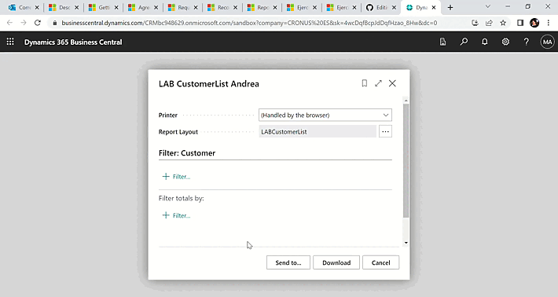
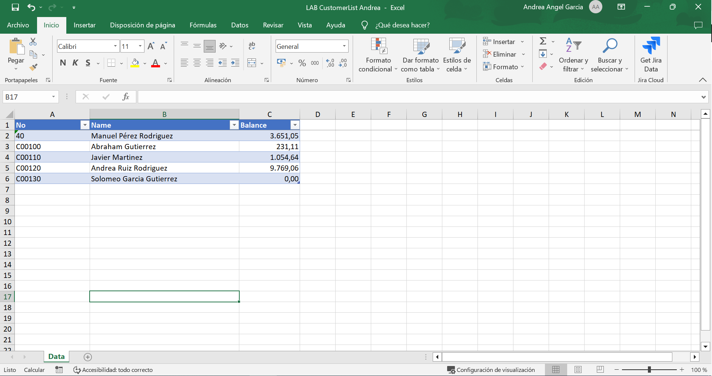
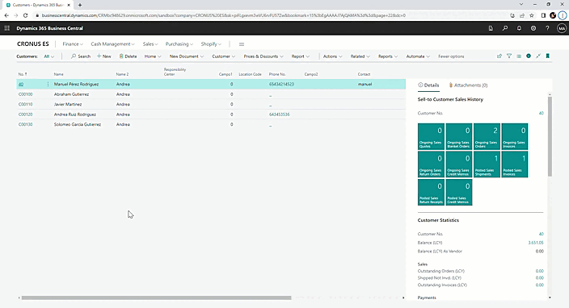

# MICROSOFT DYNAMICS 📊📈

## `Crear informes para Microsoft Dynamics 365 Business Central`

- Introducción a los componentes de informe en Dynamics 365 Business Central.
- Usar el proceso de diseño de informes en Dynamics 365 Business Central.
- Diseñar el modelo de datos de un informe en Dynamics 365 Business Central.
- Agregar un diseño a un informe en Dynamics 365 Business Central.
- Completar la página de solicitud de informe en Dynamics 365 Business Central.
- Agregar informes a Dígame y sustituir un informe en Dynamics 365 Business Central.
- Uso de los desencadenadores de informes, funciones e informes de solo procesamiento en Dynamics 365 Business Central.
- Implementar informes multilingües en Dynamics 365 Business Central.

---

## Agregar un diseño a un informe en Dynamics 365 Business Central

#### `Ejercicio: Crear un informe básico`:
Tareas:

-> Crear la extensión de página.

-> Crear el conjunto de datos.

-> Crear un diseño RDLC para el informe.

-> Crear un diseño de Word para el informe.

-> Crear un diseño Excel para el informe.

#####  CustomerList.PageExt.al
#####  LABCustomerList.Report.al

---

## Uso de los desencadenadores de informes, funciones e informes de solo procesamiento en Dynamics 365 Business Central

#### `Ejercicio: Crear un informe de solo procesamiento`

Tareas:

-> Defina el modelo de datos.

-> Agregue controles a la página Solicitud.

-> Pruebe el informe.

#####  ProcessingOnly.Report.al

---

