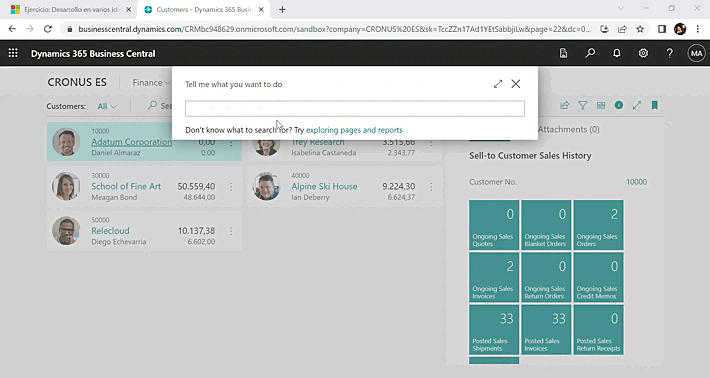
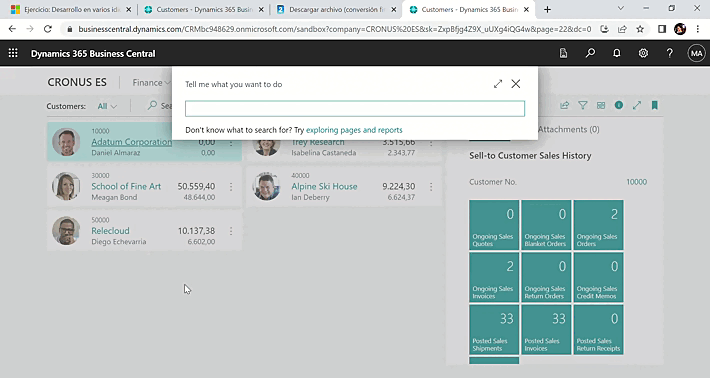
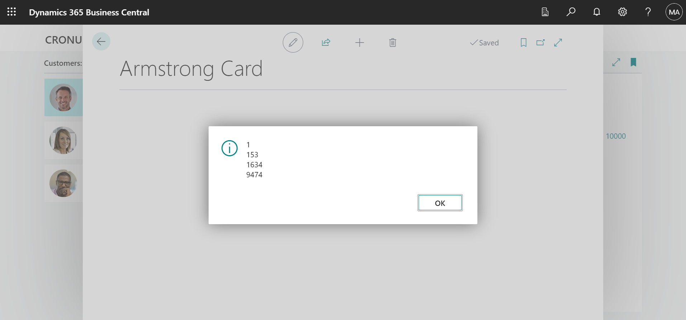
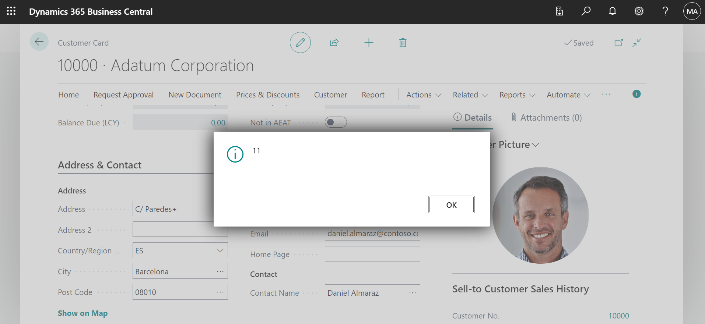
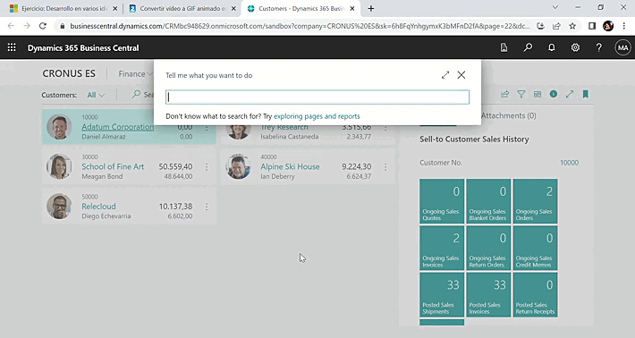
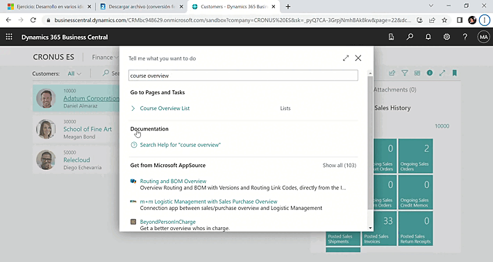
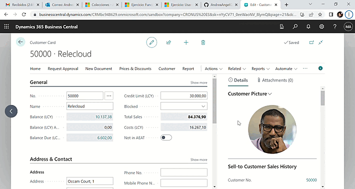

# MICROSOFT DYNAMICS 📊📈

## PROGRAMACIÓN AL 💻

### `Crear informes para Microsoft Dynamics 365 Business Central`

- Introducción a los componentes de informe en Dynamics 365 Business Central.
- Aprenda las instrucciones de AL en Dynamics 365 Business Central
- Trabajar con funciones integradas de AL en Dynamics 365 Business Central
- Gestionar errores usando el lenguaje de la aplicación en Dynamics 365 Business Central
- Crear funciones personalizadas en Dynamics 365 Business Central
- Trabajar con codeunits en Dynamics 365 Business Central
- Usar eventos y desencadenadores en Dynamics 365 Business Central
- Implementar interfaces en Dynamics 365 Business Central
- Manipular datos mediante código en Dynamics 365 Business Central
- Administración del desarrollo en varios idiomas en Dynamics 365 Business Central

---

## Agregar un diseño a un informe en Dynamics 365 Business Central

#### `Ejercicio: Crear un informe básico`:
Tareas
-> Crear la extensión de página.

-> Crear el conjunto de datos.

-> Crear un diseño RDLC para el informe.

-> Crear un diseño de Word para el informe.

-> Crear un diseño Excel para el informe.

#####  CustomerList.Page.al

---

#### `Ejercicio: Usar expresiones lógicas y relacionales` 
Tareas:
-> Crear una nueva página.

-> Definir tres variables globales, dos valores de entrada y un resultado.

-> Crear campos y usar las variables como origen.

-> Crear una acción y comprobar si entrada 1 es mayor que entrada 2.

#####  ExpressionsCard.Page.al

--- 

## Aprenda las instrucciones de AL en Dynamics 365 Business Central

#### `Ejercicio: Usar instrucciones condicionales y compuestas`
Tareas:
-> Crear una nueva página.

-> Definir tres variables globales: un valor de entrada y dos de salida

-> Crear campos y usar las variables como origen.

-> Crear un procedimiento local que calcule qué curso es el mejor según el nivel de Dificultad.

-> Obtener la información del curso al introducir un valor en el campo Dificultad.

#####  StatementsCard.Page.al 

## Trabajar con funciones integradas de AL en Dynamics 365 Business Central

#### `Ejercicio: Usar funciones integradas`
Tareas:
-> Crear una nueva página.

-> Crear el desencadenador OnOpenPage.

-> Definir variables para el cálculo de Armstrong.

-> Escribir la lógica de cálculo.

-> Mostrar el resultado en un cuadro de mensaje.

#####  ArmstrongCard.Page.al

---

## Usar eventos y desencadenadores en Dynamics 365 Business Central

#### `Ejercicio: Eventos y desencadenadores`
Tareas:
-> Crear una codeunit.

-> Crear un procedimiento local llamado CheckForPlusSign.

-> Comprobar si el parámetro contiene un signo más (+).

-> Crear un suscriptor de evento que se suscriba al evento OnBeforeValidate en el campo Dirección de la ficha de cliente.

#####  Validations.CodeUnit.al.

---

--- 
## Manipular datos mediante código en Dynamics 365 Business Central
#### `Ejercicio: Usar instrucciones de manipulación de datos`
Tareas:
-> Crear una nueva extensión AL.

-> Crear una nueva tabla.

-> Crear una página que esté vinculada a la tabla.

-> Crear una codeunit para copiar datos de diferentes tablas a la tabla recién creada.

##### CustomerOverview.Table.al
##### CustomerOverviewList.Page.al
##### CustomerOverviewMgmt.CodeUnit.al.

#### `Ejercicio: Funciones personalizadas`
Tareas:
-> Crear una nueva extensión.

-> Crear una extensión de tabla.

-> Crear una extensión de página.

##### CreditLimitExtension.TableExt.al
##### CreditLimitExtension.PageExt.al.

#### `Ejercicio: Funciones personalizadas`
Tareas:
-> Crear una nueva extensión.

-> Crear una extensión de tabla.

-> Crear una extensión de página.

##### CreditLimitExtension.TableExt.al.
##### CreditLimitExtension.PageExt.al.

